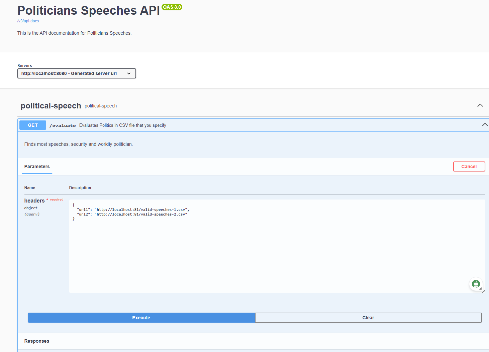
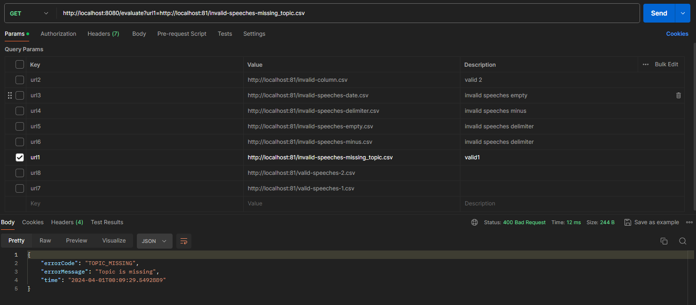

# Political Speech

Process statistics about political speeches.

### Requirements

- Java 17, Gradle, Static File/Http Server(ie. Nginx)

### Configuration

- You can change variables from `application.properties` under resources
-

### To run project

```
Build it:
./gradlew build

Execute the tests: (!requires csv files hosted in "http://localhost:81" for integration tests)
./gradlew test

Run it (locally):
./gradlew bootRun
```

## Usage

The application exposes a GET endpoint `/evaluation` that accepts CSV file URLs as query parameters (
e.g., `/evaluation?url1=link_to_csv1&url2=link_to_csv2`). It processes these CSV files to answer questions like which
politician gave the most speeches in a specific year, who spoke most about homeland security, and who was the least
wordy.

### Configurations

* For integration test to success, change csv.server.address" property in application.properties to where you host your
  CSV files
* For changing timeout for fetching CSVs, change "csv.server.address" property in application.properties

```
csv.server.address=http://localhost:81
fetch.csv.timeout=2000
```

* Below values are coming from application.properties

```
- speech.target-year=2013
- speech.security-topic=homeland security
```

### Endpoint

```
GET /evaluate?url1=https://example.com/valid-speeches-1.csv
Host: localhost:8080

- Tip: Yuu can use nginx easily for host static files
```

### Swagger and ApiDoc addresses:

[Swagger UI](http://localhost:8080/swagger-ui/index.html)

[Api Documentation](http://localhost:8080/v3/api-docs)

[Postman Collection URL](https://www.postman.com/bgunay1/workspace/public-workspace/request/1152813-947921c1-691a-4d43-b70a-3284e0d0ada5)

- Postman workspace (collection) containing requests
- Serving in your local or cloud storage recommended

## Screenshots

Swagger Request View:<br />
[Swagger UI](http://localhost:8080/swagger-ui/index.html)



<br />

Postman Collection:
[Postman Collection URL](https://www.postman.com/bgunay1/workspace/public-workspace/request/1152813-947921c1-691a-4d43-b70a-3284e0d0ada5)


### Restrictions

- Url format should be `/evaluate?url1=...&url2=...&urln=...` Other query-params will be ignored.
- Url schema should be `http` or `https`. Other protocols (`file`, `ftp`...) give error.
- CSV file schema should be `Speaker ; Topic ; Date ; Words` And all fields are required (not-null)
- Date format should be `yyyy-MM-dd`. Other formats give parser error.
- `Words` should be greater than `0`
- fetch.csv.timeout can not exceed
-

## Architecture

* HttpClient: Custom client for handling HTTP requests to download CSV files.
* CsvParserService: Parses CSV data into Speech objects.
* EvaluationService: Analyzes the speeches and computes the statistics.
* CsvHttpService: Uses httpClient and fetches CSV data asynchronously

## Thought Process and Decisions

* Modular Architecture: The project adopts a modular design for ease of maintenance and scalability. Each module, like
  HttpClient, CsvParserService, CsvHttpService and EvaluationService, is responsible for a specific aspect of the
  application, ensuring separation of concerns.
* RestTemplate HTTP Client: Used for fetching files.
* CSV Parsing Strategy: The CsvParserService was designed to transform CSV data into Speech objects. This approach was
  chosen for its simplicity and efficiency, allowing the application to directly process the structured CSV data.
#### V1 (branch) is first implemented
#### V2 (branch)
Some of the ambiguities were removed, separation of concerns implemented cleaner, flow is changed.
#### V3 (branch) 
Goroutines added for fetch all CSVs at one request and mockk lib used for mocking instead of mockito in service.
#### V4 (branch) - Most Stable( all tests works)
timeout added for requests and new service created for CSV file fetching operation, tests and exceptions added for timeout, logger implementation performance increased and verbose fixed.
#### V5 (branch) - Advanced, Final implementation
Webclient used instead of restClient and runBlocking removed and suspending controller function used.<br />
Springmockk implementation used instead of mockito.<br />
Asynchronous map implementation added for conciseness.<br />
HttpClientIntegrationTest test fixed according to new implementation.<br>
We have 3 different endpoints in controller and two different tests for async endpoints, one is coroutineScope and other
is Flow. Third endpoint is sync (normal) endpoint. Right scopes used for flow and exception control.


## Algorithms

* Speech Analysis: The core analysis algorithms reside in the SpeechService. These algorithms focus on grouping and
  aggregating speech data to derive meaningful statistics.
* Most Speeches: Aggregates speeches by speaker and year, then identifies the speaker with the highest count.
* Most Security Talks: Filters speeches on the topic of "homeland security" and performs similar aggregation to find the
  top speaker.
* Least Wordy: Calculates the total word count for each speaker across all speeches, finding the one with the minimum
  word count.
* Unique Max/Min Finder: A specialized algorithm was developed to ensure that the results for the most and least are
  unique. If multiple politicians share the top or bottom spot, the algorithm returns null, adhering to the requirement
  for a unique answer.

## Error Handling

* Custom Exceptions: EvaluationServiceException, CsvParsingException and CsvPHttpException were introduced to handle
  specific error scenarios. This ensures that the application provides clear and actionable error messages, enhancing
  the robustness of the system.
* ErrorCodes: ErrorCode Enum used for ensuring a user-friendly API experience.

## Testing

* Unit Tests: Ensure individual components function correctly based on possible real life scenarios.
* Integration Tests: Verify the integration of different components and the overall workflow.
* Reference for controller endpoints https://docs.spring.io/spring-framework/reference/languages/kotlin/coroutines.html
