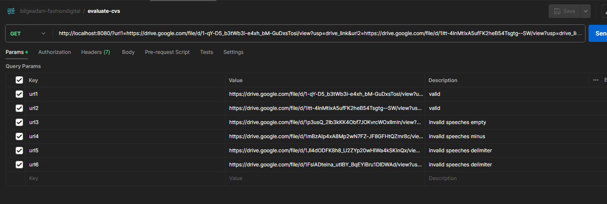
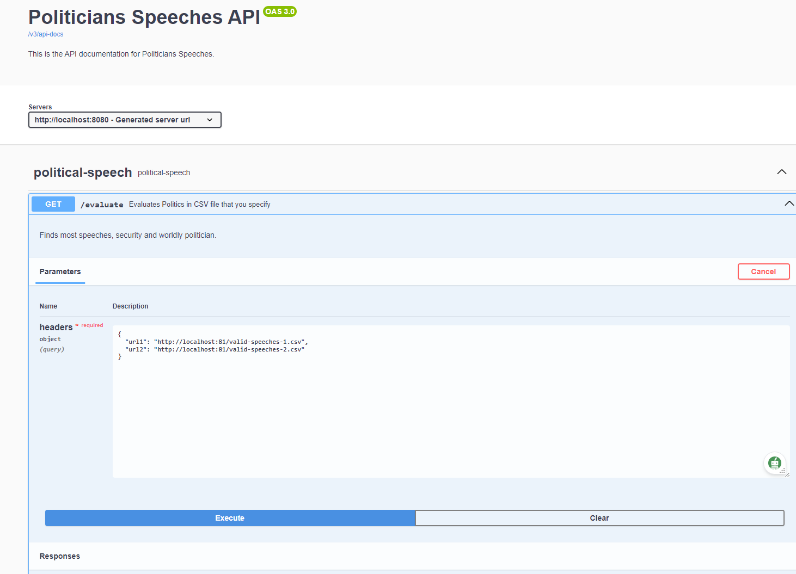

# Political Speech
Process statistics about political speeches.
### Requirements
- Java 17, Gradle, Static File Server(nginx)

### Configuration
- You can change variables from `application.properties` under resources

### To run project
```
gradlew bootRun
```

## Usage
### Evaluating Speeches
The application exposes a GET endpoint `/evaluation` that accepts CSV file URLs as query parameters (e.g., `/evaluation?url1=link_to_csv1&url2=link_to_csv2`). It processes these CSV files to answer questions like which politician gave the most speeches in a specific year, who spoke most about homeland security, and who was the least wordy.


### To run tests
```
gradlew test
```

### Endpoint
```
GET /evaluate?url1=https://example.com/valid-speeches-1.csv
Host: localhost:8080

- Yuu can use nginx easily for host static files
```
### Swagger and ApiDoc addresses:
```
http://localhost:8080/swagger-ui/index.html
http://localhost:8080/v3/api-docs
```

- Postman workspace (collection) containing request with public csv urls
```
https://www.postman.com/bgunay1/workspace/public-workspace/collection/1152813-9c321f49-1a3a-4189-841b-e4ead905e850?action=share&creator=1152813
```
- 


Swagger Request View:
-  
- 
### Restrictions
- Url format should be `/evaluate?url1=...&url2=...&urln=...` Other query-params will be ignored.
- Url schema should be `http` or `https`. Other protocols (`file`, `ftp`...) give error.
- CSV file schema should be `Speaker ; Topic ; Date ; Words` And all fields are required (not-null)
- Date format should be `yyyy-MM-dd`. Other formats give parser error.
- `Words` should be greater than `0`